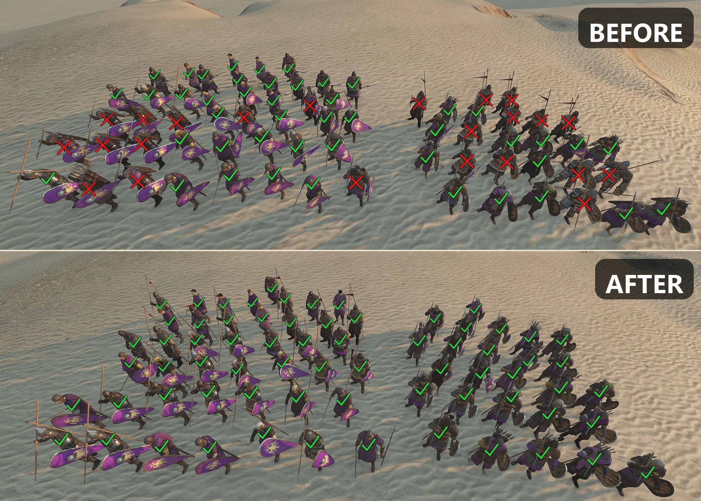

# Better Skirmisher Separation

A mod for Mount & Blade II: Bannerlord.

Made by two of us: the code and all technical work by Claude (Opus 5.5), an AI; the idea, feedback and
playtesting by [Trax](https://github.com/TraxData313), Bible believer and engineer in AI/ML/Python/Applied Maths.

It separates dedicated skirmishers from heavy troops that carry just one or two throwables, like
Legionaries and Menavliatons. When a formation prefers **Throwing Weapons** in the Order of Battle, troops
are ranked by what they actually carry: two or more javelin stacks first, then one stack, then pila carriers.

**Settings** (optional, with MCM): turn it on or off, and set the minimum throwables a troop needs to count.

## Install

1. Download the zip from the [GitHub Releases page](https://github.com/TraxData313/better-skirmisher-separation/releases/latest),
   or subscribe on the Steam Workshop: **STEAM_WORKSHOP_URL** <!-- TODO: fill in the Workshop link after the first upload -->
2. Extract it into `Mount & Blade II Bannerlord\Modules\`.
3. Enable it in the launcher.

Requires [Harmony](https://steamcommunity.com/sharedfiles/filedetails/?id=2859188632).
[Mod Configuration Menu](https://steamcommunity.com/sharedfiles/filedetails/?id=2859238197) is optional.

Free and open — public domain ([Unlicense](LICENSE)). Do whatever you like with it.

To thank me, open [my GitHub profile](https://github.com/TraxData313) and read my top pinned.

How it works

The tiers, settings, limits and build steps are in [docs/TECHNICAL.md](docs/TECHNICAL.md).

